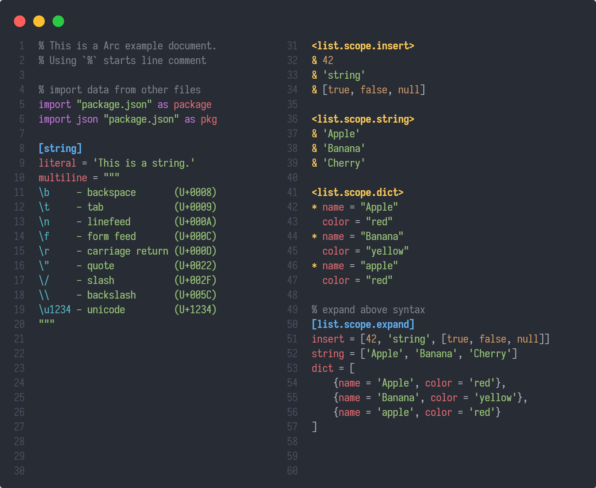

# Arc Readable Configuration

## Choose your language

- [简体中文](/cn/basic/)
- [English](/en/basic/)

## DataType

| Type     | Example             | Remark           |
| :------- | :------------------ | :--------------- |
| Integer  | `42`                | Atom, BigInteger |
| Decimal  | `1.234`             | Atom, BigDecimal |
| String   | `'literal'`         | Atom             |
| Cite     | `$cite.path`        | Atom             |
| Special  | `true`, `null`      | Atom             |
| List     | `[1, 2, 3]`         | Container        |
| Dict     | `{1: 3}`            | Container        |
| DictMark | `[dict.path]`       | Scope            |
| ListMark | `<list.path>`       | Scope            |

## How to Start

Try vscode support: [VScode - ARC](https://github.com/GalAster/vscode-arc/tree/master)

Following [json migration tutorial](https://github.com/Moe-Net/Arc-Language/blob/master/i18n/en/From%20JSON.md).

